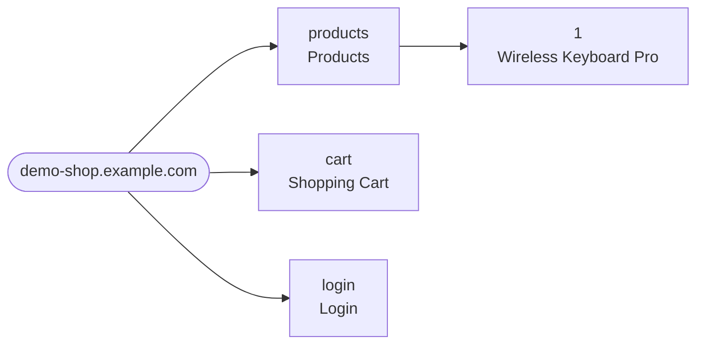
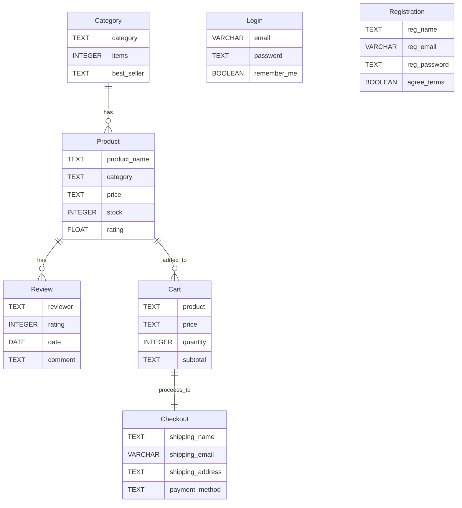

# Pathray

> Automated web structure analysis and ERD generation

[한국어](README.ko.md) | English


## What is Pathray?

Analyzing a website's structure and data manually means visiting every page, cataloging tables and forms, and figuring out how the data relates. It's tedious, error-prone, and hard to keep up-to-date.

**Pathray** automates this entire process. Give it a URL, and it will:

1. **Crawl** the entire site using Playwright (BFS, concurrency-controlled)
2. **Extract** structured data — tables, forms, text, metadata — from every page
3. **Generate** a database ERD with inferred entities and relationships

## Quick Start

```bash
# Install
git clone https://github.com/choo121600/pathray.git
cd pathray
uv sync
uv run playwright install chromium

# Run the full pipeline on any website
pathray run https://demo-shop.example.com
```

That's it. Check the `output/` directory for your results.

## Example Output

Running `pathray run` on an e-commerce site produces the following (see [`examples/demo-shop/`](examples/demo-shop/) for full sample data):

### Site Structure Tree



### Extracted Data (per page)

Each page produces a structured JSON with tables, forms, text, and metadata:

```json
{
  "url": "https://demo-shop.example.com/products",
  "tables": [
    {
      "headers": ["Product Name", "Category", "Price", "Stock", "Rating"],
      "rows": [
        ["Wireless Keyboard Pro", "Keyboards", "$79.99", "142", "4.5"],
        ["Ergonomic Mouse X1", "Mice", "$49.99", "89", "4.7"],
        ["4K UltraWide 34\"", "Monitors", "$599.99", "23", "4.8"]
      ]
    }
  ],
  "forms": [
    {
      "action": "/products/search",
      "method": "GET",
      "fields": [
        {"name": "query", "type": "text", "required": true},
        {"name": "category", "type": "select", "required": false}
      ]
    }
  ]
}
```

### Generated ERD



### Generated SQL DDL

```sql
CREATE TABLE "Product" (
    "product_name" TEXT,
    "category" TEXT,
    "price" TEXT,
    "stock" TEXT,
    "rating" TEXT
);

CREATE TABLE "Review" (
    "reviewer" TEXT,
    "rating" TEXT,
    "date" TEXT,
    "comment" TEXT
);

CREATE TABLE "Checkout" (
    "shipping_name" TEXT,
    "shipping_email" VARCHAR,
    "shipping_address" TEXT,
    "shipping_city" TEXT,
    "shipping_zip" TEXT,
    "payment_method" TEXT,
    "card_number" TEXT,
    "card_expiry" TEXT,
    "coupon_code" TEXT
);
```

### Extraction Summary

```json
{
  "total_pages": 5,
  "total_tables": 5,
  "total_forms": 4,
  "total_images": 9,
  "unique_form_fields": ["email", "password", "product_id", "quantity", "shipping_name", "..."]
}
```

## Features

- **Sitemap Crawling** — BFS-based recursive crawling with concurrency control, automatic dedup and external link filtering
- **Data Extraction** — HTML tables, form fields, text blocks, and metadata converted to structured JSON
- **ERD Generation** — Auto-inferred entities and relationships, output as Mermaid diagrams, SQL DDL, PNG/SVG images
- **AI Analysis** — High-quality entity inference using Claude CLI (`--ai` flag)
- **Site Tree Visualization** — Mermaid tree diagram of the entire site structure

## Data Flow

```
[Root URL] → [Playwright Crawler] → [Sitemap JSON]
                                          |
                                   [Data Extractor]
                                          |
                               [Page Data JSON files]
                                          |
                                 [ERD Generator]
                                     |      |
                             [Mermaid ERD] [SQL DDL]
                                     |
                               [PNG/SVG Image]
```

## Installation

### Requirements

- Python 3.12+
- [uv](https://docs.astral.sh/uv/) package manager
- Node.js (optional, for ERD image rendering)

### Setup

```bash
git clone https://github.com/choo121600/pathray.git
cd pathray
uv sync
uv run playwright install chromium
```

## Usage

### Full Pipeline (Recommended)

```bash
# Crawl → Extract → Generate ERD in one command
pathray run https://example.com
```

### Step-by-Step

```bash
# 1. Crawl and generate sitemap
pathray crawl https://example.com --depth 3

# 2. Extract data from each page
pathray extract output/sitemap.json

# 3. Generate ERD from extracted data
pathray erd output/data/

# 4. Visualize site structure (optional)
pathray tree output/sitemap.json
```

### With AI Analysis

```bash
# Use Claude CLI for smarter entity inference
pathray run https://example.com --ai
```

## CLI Reference

### Global Options

| Option | Description |
|--------|-------------|
| `--version`, `-v` | Show version |
| `--help` | Show help |

### `pathray crawl`

Crawl a website and generate a sitemap.

```
pathray crawl [OPTIONS] URL
```

| Option | Short | Type | Default | Description |
|--------|-------|------|---------|-------------|
| `URL` | | TEXT | (required) | Target URL |
| `--depth` | `-d` | INTEGER | `5` | Max crawl depth |
| `--concurrency` | `-c` | INTEGER | `3` | Max concurrent pages |
| `--output` | `-o` | TEXT | `output/sitemap.json` | Output file path |
| `--silent` | `-s` | | `false` | Suppress progress output |

### `pathray extract`

Visit each page in the sitemap and extract structured data.

```
pathray extract [OPTIONS] SITEMAP
```

| Option | Short | Type | Default | Description |
|--------|-------|------|---------|-------------|
| `SITEMAP` | | TEXT | (required) | Sitemap JSON file path |
| `--output` | `-o` | TEXT | `output/data/` | Output directory |
| `--concurrency` | `-c` | INTEGER | `3` | Max concurrent pages (min 1) |
| `--silent` | `-s` | | `false` | Suppress progress output |
| `--dump-html` | | | `false` | Save raw HTML for each page |

### `pathray erd`

Generate an ERD from extracted page data.

```
pathray erd [OPTIONS] PAGES_DIR
```

| Option | Short | Type | Default | Description |
|--------|-------|------|---------|-------------|
| `PAGES_DIR` | | TEXT | (required) | Extracted pages directory |
| `--output` | `-o` | TEXT | `output/erd.json` | Output file path |
| `--format` | `-f` | TEXT | `json` | Output format (`json`, `mermaid`) |
| `--threshold` | `-t` | FLOAT | `0.6` | Entity merge Jaccard similarity threshold (0.0~1.0) |
| `--ai` | | | `false` | Use AI (Claude CLI) for entity inference |

### `pathray tree`

Visualize crawled sitemap as a Mermaid tree diagram.

```
pathray tree [OPTIONS] SITEMAP
```

| Option | Short | Type | Default | Description |
|--------|-------|------|---------|-------------|
| `SITEMAP` | | TEXT | (required) | Sitemap JSON file path |
| `--output` | `-o` | TEXT | `output/sitemap-tree.mmd` | Output file path |

### `pathray run`

Run the full pipeline: crawl → extract → erd

```
pathray run [OPTIONS] URL
```

| Option | Short | Type | Default | Description |
|--------|-------|------|---------|-------------|
| `URL` | | TEXT | (required) | Target URL |
| `--output` | `-o` | TEXT | `output/` | Output directory |
| `--depth` | `-d` | INTEGER | `0` | Max crawl depth (0 = unlimited) |
| `--concurrency` | `-c` | INTEGER | `3` | Max concurrent pages |
| `--format` | `-f` | TEXT | `json` | ERD output format (`json`, `mermaid`) |
| `--ai` | | | `false` | Use AI (Claude CLI) for entity inference |
| `--dump-html` | | | `false` | Save raw HTML for each page |

## Output Structure

```
output/
├── sitemap.json          # Crawled sitemap (URLs, titles, depths, status codes)
├── sitemap-tree.mmd      # Site structure Mermaid tree diagram
├── sitemap-tree.png      # Site structure tree image (requires Node.js)
├── sitemap-tree.svg      # Site structure tree SVG (requires Node.js)
├── data/
│   ├── page-000.json     # Per-page extracted data (tables, forms, text, meta)
│   ├── page-001.json
│   ├── ...
│   └── html/             # Raw HTML (with --dump-html)
│       ├── page-000.html
│       └── ...
├── summary.json          # Extraction summary report
├── erd.json              # Inferred entities and relationships (JSON)
├── erd.mmd               # Mermaid erDiagram syntax
├── erd.png               # ERD image (requires Node.js)
├── erd.svg               # ERD SVG (requires Node.js)
└── schema.sql            # SQL CREATE TABLE DDL
```

## Development

```bash
# Setup
uv sync
uv run playwright install chromium

# Run tests
uv run pytest

# Run tests with coverage
uv run pytest --cov=pathray

# Lint
uv run ruff check .
```

## Tech Stack

| Area | Technology |
|------|-----------|
| Language | Python 3.12+ |
| Package Manager | uv |
| Crawling | Playwright |
| CLI | Typer + Rich |
| Data Models | Pydantic v2 |
| ERD Rendering | Mermaid (mermaid-cli) |
| Testing | pytest + pytest-asyncio |
| Linter | ruff |

## License

[MIT](LICENSE)

